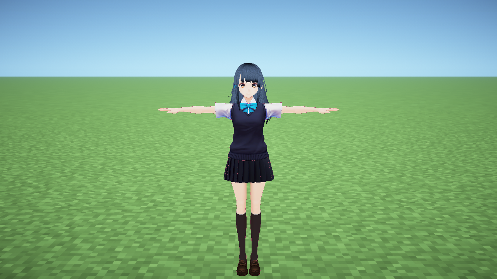

# Celerant VRM

Load local VRM 0.x/1.0 models in Minecraft 26.2 on **Fabric** and **NeoForge** with MCglTF, and optionally composite VRM `ToonShader` materials on top of the final Iris ShaderPack scene.



The example model is VRoid Project **Sendagaya Shino** ([CC0 1.0](https://creativecommons.org/publicdomain/zero/1.0/), [terms of use](https://vroid.pixiv.help/hc/en-us/articles/4402614652569-Do-VRoid-Studio-s-sample-models-come-with-conditions-of-use) / [OpenGameArt mirror](https://opengameart.org/content/vroid-studio-cc0-models)). The still above was captured 2026-08-25 with Celerant + MCglTF ToonShader 2.3.2.8 under an active Complementary Unbound Iris ShaderPack, using the generated LightMap / face-SDF / ramp sidecar in [`docs/examples/sendagaya-shino/`](docs/examples/sendagaya-shino/). Only CC0 models appear in committed README images; the `.vrm` itself is not vendored. Regenerate maps with `generate_toon_assets.py` after download, which is a thin wrapper over [`scripts/vrm_toon_assets.py`](scripts/vrm_toon_assets.py) and derives the same data for any VRM. Visual target: official [`UnityGenshinToonShader`](https://github.com/kaze-mio/UnityGenshinToonShader) `Images/image_0.png` (soft cheek SDF, warm lit albedo, thin outlines, bounded rim).

## Required mods

### Fabric

- Fabric Loader 0.19.3+
- Fabric API 0.156.0+26.2
- [MCglTF 26.2-2.4.0 (Fabric)](https://github.com/westernbear/MCglTF/releases/tag/v26.2-2.4.0)
- Iris 1.11.2+26.2-fabric and the Sodium 0.9.x build Iris requires
- [OneConfig for Fabric 26.2](https://modrinth.com/mod/oneconfig/version/UCFu181L) plus Compose Multiplatform and Fabric Language Kotlin

### NeoForge

- NeoForge 26.2.0.1-beta+
- [MCglTF 26.2-2.4.0 (NeoForge)](https://github.com/westernbear/MCglTF/releases/tag/v26.2-2.4.0)
- Iris 1.11.2+26.2-neoforge and Sodium for NeoForge (Embeddium stack)
- OneConfig (Fabric API artifacts are used at compile time on NeoForge today)

External mods are not bundled in the Celerant JARs. Local builds use MCglTF multiloader JARs:

```bash
./gradlew buildAll \
  -PlocalMcgltfApi=/path/mcgltf-api-26.2-26.2-2.4.0.jar \
  -PlocalMcgltfCommon=/path/mcgltf-common-26.2-26.2-2.4.0.jar \
  -PlocalMcgltfFabric=/path/MCglTF-Fabric-26.2-2.4.0.jar \
  -PlocalMcgltfNeoForge=/path/MCglTF-NeoForge-26.2-2.4.0.jar
```

CI downloads the same artifacts from the MCglTF GitHub Release (or builds `mcgltf-common` when the release omits it).

## Public API

Other mods can compile against [`celerant-api`](api/README.md) and depend on the loader JAR at runtime:

```java
CelerantApi.get().localAvatar().ifPresent(handle -> { /* ... */ });
```

See [`api/README.md`](api/README.md) for Gradle coordinates and surface types.

## Usage

1. In-world, press `V` to open the OneConfig **Celerant VRM** control center. Rebind the key in Minecraft Controls or OneConfig’s global Keybinds screen.
2. Under **VRM model**, pick a self-contained GLB `.vrm` and press **Load**.
3. On the same screen, adjust placement, scale, expressions and weights, local-player replacement, and Iris toon shading. Results and errors show as OneConfig notifications.
4. Use **Runtime status** for the current model, rig, expression, and ShaderPack state, and **Unload** to restore the vanilla player.

The legacy `/celerant vrm ...` commands remain for automation and debugging. Command-based loads only accept relative paths under `.minecraft/celerant/models/`, while the OneConfig file picker safely validates an absolute `.vrm` path the user explicitly selected.

The loader rejects directory escapes, symlink escapes, files larger than 256 MiB, and glTF assets that need external references. Humanoid-node glTF matrices are supported when they decompose losslessly to TRS; shear or singular transforms that cannot be animated safely are rejected.

Avatar mode uses the same VRM in first and third person. VRM first-person annotations hide head meshes, and Minecraft `PlayerModel` look, idle, walk/run, attack/item, crouch, ride, swim, and elytra poses are applied to the humanoid rig every frame. Ordinary jumps synthesize separate rising and falling joint poses from vertical velocity. A minimum of `hips`, `spine`, `head`, both upper/lower arms and hands, and both upper/lower legs and feet (15 joints) with a correct parent hierarchy is required.

Retargeting follows [pixiv/three-vrm’s normalized humanoid design](https://github.com/pixiv/three-vrm/blob/cbd9a77a0d17f0099fdac5dcc2b4c7ee30342869/packages/three-vrm-core/src/humanoid/VRMHumanoidRig.ts), reimplemented independently in Java/JOML. Animation deltas are converted into each bone’s parent rest space and composed onto the original rest pose; hips translation also goes through the inverse of the parent world transform so bone roll and rotated/scaled parents are preserved.

A non-zero VRM0 `firstPersonBoneOffset` is converted from VRM0 Z into glTF coordinates for the first-person camera anchor; zero or missing values fall back safely to the Minecraft eye position.

Only the local player is replaced today. Network sync for other players’ VRMs and IK/VR trackers are out of scope. VRM spring bones (`VRMC_springBone` / VRM0 `secondaryAnimation`) are simulated client-side with the UniVRM / three-vrm Verlet reference (rest-axis stiffness, gravity, drag, length constraint, sphere/capsule colliders); toggle under OneConfig Motion → Spring bone. Vanilla armor, held-item, cape, and elytra render layers are hidden in avatar mode to avoid duplicate meshes, while those poses still drive the VRM rig.

## ToonShader and ShaderPack boundaries

Celerant does not modify, store, or redistribute ShaderPack ZIPs, original GLSL, Iris-transformed programs, or G-buffer attachments. After Iris `finalizeLevelRendering`, MCglTF’s separate `ToonShader` renderer draws selected VRM primitives into its own HDR color/depth targets, compares against ShaderPack scene depth, and composites onto the main color target with premultiplied alpha. There is no branching on pack name, archive hash, or per-pack thresholds, and unknown ShaderPack storage formats are never guessed with a codec.

Ordinary MCglTF users keep the standard glTF/MToon path. Only models Celerant explicitly requests with `RenderedGltfModel.MTOON_OVERLAY_REQUEST` enter the ToonShader queue, so MCglTF as a whole is not turned into a toon-only renderer. When ShaderPacks are off, MCglTF’s existing managed MToon pass is used.

If a `model.vrm.toon.json` v2 sidecar is present, you can author per-material or per-mesh-primitive LightMap/ramp data, separate face LightMap and shadow SDF with head forward/right, authored or explicitly generated smooth normals, normal-map tangents, metal/non-metal specular and matcap, emission, blush, depth rim, outline width texture/vertex alpha/distance scale/per-material color, and base/outline screen offsets. Standard MToon materials without a sidecar still run with a neutral fallback, but data outside the VRM standard (LightMap, face SDF, and similar) is never inferred from other textures. See the **Optional ToonShader sidecar** section in the MCglTF README for the schema.

## Deriving sidecar data for any VRM

[`scripts/vrm_toon_assets.py`](scripts/vrm_toon_assets.py) writes a v2 sidecar and its LightMap, face SDF, ramp, and matcap textures for an arbitrary VRM, with nothing keyed to a model or to material names. The face material is taken from the mesh the VRM blink and vowel expressions drive, the head is separated from the body by the head-bone skin weights that the specification's first-person `auto` rule uses, and forward/right follow the VRM coordinate table, which is `-Z`/`+X` for VRM 0.x and `+Z`/`-X` for VRM 1.0. Where a model carries no expressions, the head-attached surface facing furthest forward is used instead, and a humanoid map that points `head` at a leaf joint is repaired to the joint that actually carries the eye, hair, and jaw joints. When no face can be identified at all, the facial SDF path is left unconfigured and reported rather than approximated with a generic effect.

[`scripts/check_vrm_corpus.py`](scripts/check_vrm_corpus.py) runs that derivation across directories of models and fails if a character's face cannot be found, if the two face SDF channels stop being complementary, if a ramp runs light-to-shadow instead of shadow-to-light, or if the lit sweep stops following the character's right axis in object space. Feature-test scenes that are not avatars are reported as skipped rather than as misses.

```bash
python3 -m venv .venv && .venv/bin/pip install pillow numpy
.venv/bin/python scripts/vrm_toon_assets.py /absolute/path/model.vrm
.venv/bin/python scripts/check_vrm_corpus.py /path/to/vrms --build /tmp/out
```

The same derivation is available in game. **Generate Toon assets** under **Rendering** writes the profile and its sheets beside the selected `.vrm`, so a model can be profiled without a Python toolchain. It only runs when you press it, never overwrites anything already there, and runs off the render thread because it reads and resamples every texture in the model. When no face material can be identified it says so and leaves facial shadow shaping unconfigured, exactly as the script does.

Both paths share the same algorithms, down to the arithmetic precision, the order values accumulate in, and the eight-bit resampling pipeline. MCglTF's `ToonAssetParityTest` derives the example model both ways and requires every sheet to agree; most come out byte-identical and none may differ by more than one level on more than a handful of channels. Without that gate the two would drift and a model profiled in game would shade differently from the same model profiled on the command line.

Users must verify the licenses and terms of their VRM models and installed ShaderPacks themselves.

Celerant is distributed under AGPL-3.0-only per the repository `LICENSE`.

## Testing

On Linux, the full user flow runs against a real Fabric client, OneConfig, Iris, and Sodium under llvmpipe. The client GameTest opens the OneConfig screen with the real `V` binding, finds control coordinates from the Compose accessibility tree, then drives categories, file picking, numeric/text/slider/switch controls, every action button, and screen re-entry with mouse and keyboard. Invalid/valid file loads, placement, scale, expressions, avatar mode, Motion (L3/breathing/sway/spring), Multiplayer upload-without-plugin and cache clear, radial menu (`B`), first-person vanilla arm cancel, status, toon toggle, and unload are asserted via runtime status, mixin probes, and OneConfig notifications. In headless environments the real file-picker button is clicked and only the OS native dialog return value is replaced by a test mixin; the requested title and `*.vrm` filter are still checked. OS-level captures of the X11 world and control-center frames confirm the UI changes at least 40% of the window. Closing the screen must leave the Iris pipeline and ShaderPack intact.

The same client GameTest renders the same VRM with ToonShader ON/OFF/restored ON from a fixed camera. Scene and model bounds must hold, and at least 30% of model pixels that are stable across both ON frames must change only in OFF.

```bash
xvfb-run -a -s "-screen 0 1280x720x24" ./gradlew :fabric:runClientGameTest --offline
```

NeoForge smoke harness (platform + ToonShader toggle):

```bash
xvfb-run -a -s "-screen 0 1280x720x24" ./gradlew :neoforge:runClientGameTest -PirisRuntime=true --offline
```

Test VRMs and ShaderPacks are created dynamically in the run directory and are not shipped in the release JAR. When a local model is set, a same-named `.toon.json` and referenced PNGs are copied into the test run directory only.

Local VRM daylight toon rendering takes a model path from an environment variable, asserts near-noon ON/OFF/restored ON pixels, and captures 1280×720 front/back, first-person, walk, and jump rising/falling frames at morning (0), noon (6000), dusk (12500), and night (18000). That path keeps copyrighted models out of CI while still allowing local visual approval of real materials and style; it does not replace the synthetic VRM CI assertions above.

```bash
CELERANT_VISUAL_VRM=/absolute/path/model.vrm \
xvfb-run -a -s "-screen 0 1280x720x24" ./gradlew runClientGameTest --offline
```

Comparison images land in `build/run/clientGameTest/screenshots/`; the model is deleted when the test ends. Local VRM/toon images are not part of the release artifact; only the two synthetic OneConfig screen captures are uploaded as main/PR CI artifacts.

### ShaderPack matrix

The command below copies each ZIP to a temp location (preserving the source SHA-256), records ToonShader ON/OFF/restored captures, Iris active state, unchanged entity-program counts, and 12-frame median/p95/p99 times into `celerant-shaderpack-matrix.tsv`. Judge performance numbers on a real GPU.

```bash
CELERANT_SHADERPACK_DIR=/absolute/path/to/shaderpack-zips \
CELERANT_VISUAL_VRM=/absolute/path/model.vrm \
xvfb-run -a -s "-screen 0 1280x720x24" ./gradlew runClientGameTest --offline
```

As of 2026-08-25 on Iris 1.11.2 / MCglTF 2.3.2.8, the current Modrinth 26.2-compatible BSL R10.1.3, Complementary Reimagined r5.8.1, and Complementary Unbound r5.8.1 packs were inspected directly with a local validation VRM and each pack active. Height-matched comparisons against the official `UnityGenshinToonShader` images, ON/OFF/restored frames, opposed face lighting, and native plus 4× nearest-neighbour crops all passed the face SDF, material ramp, smooth normal, outline, rim/specular, and compositing gates after the Unity-aligned outline path and geometry-based blush/eye placement landed. All three packs kept source SHA-256 intact, `patched_entity_programs=0/9`, and restored pixel stability `1.000`. llvmpipe 1280×720 ON/OFF median frame times were BSL 753/785 ms, Reimagined 624/580 ms, and Unbound 716/630 ms. Those are software-renderer numbers, not real-GPU performance. Shipped README and example images use only the CC0 Sendagaya Shino sample under [`docs/examples/sendagaya-shino/`](docs/examples/sendagaya-shino/); copyrighted models stay in local-only validation runs.

Local MCglTF builds override Maven during capture and GameTest:

```bash
./gradlew :fabric:runClientGameTest --offline \
  -PlocalMcgltfApi=... -PlocalMcgltfCommon=... -PlocalMcgltfFabric=...
```

## CI and releases

The main branch and pull requests run `:common:test`, `:fabric:runClientGameTest`, and `:neoforge:runClientGameTest`. Create a release from a clean, synced `main` branch:

```bash
./scripts/release.sh 26.2-1.3.0
```

The Release workflow for `v*` tags re-runs Fabric and NeoForge client tests, then publishes **Celerant-Fabric**, **Celerant-NeoForge**, and **celerant-api** JARs with SHA-256 checksums.
